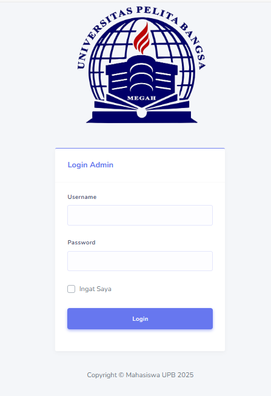
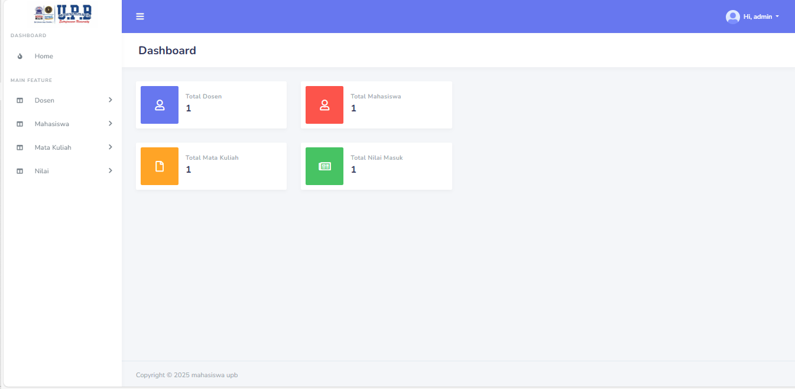
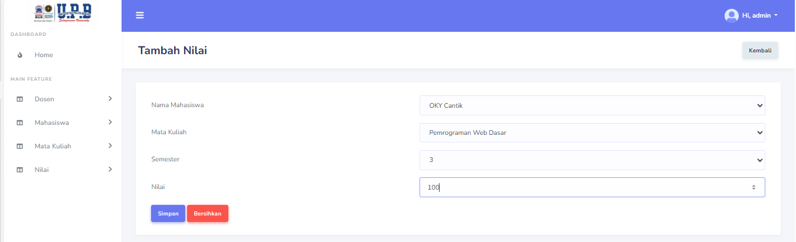
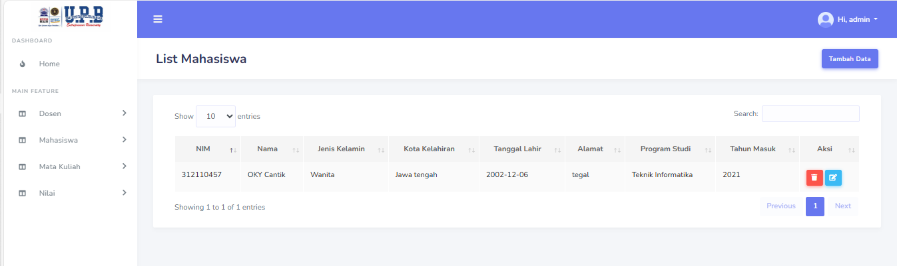

# 📊 **PHP Native Dashboard**

Dashboard sederhana berbasis **PHP Native** dengan fitur CRUD untuk mengelola data dosen, mahasiswa, mata kuliah, dan nilai.

---

## ✅ **Features**
- 🔐 Login Admin  
- 🧑‍🎓 Tambah/Edit/Hapus **Dosen**  
- 🎓 Tambah/Edit/Hapus **Mahasiswa**  
- 📚 Tambah/Edit/Hapus **Mata Kuliah**  
- 🖍 Tambah/Edit/Hapus **Nilai Mata Kuliah**

---

## 🌟 **Tech Stack**
- PHP Native
- Bootstrap 5
- MySQL Database
- HTML, CSS, JS

---

## 📸 **Demo Web**
Berikut adalah beberapa tampilan dari aplikasi:

<p align="center">
  #menu login
  
  #Dasboard
  
  #add data
  
  #View data page
  
</p>

---

## 💁 **Project Structure**
Struktur direktori dalam proyek ini:

```
# Root Project
.
├── assets                 # Berisi file CSS, JS, Bootstrap, dan gambar
│
├── dashboard              # Halaman dashboard utama
│
├── data                   # File database dan screenshot demo
│
├── dosen                  # Halaman manajemen dosen
│
├── helper                 # File koneksi database dan autentikasi login
│
├── layout                 # Template untuk sidebar, top bar, dan footer
│
├── mahasiswa              # Halaman manajemen mahasiswa
│
├── matakuliah             # Halaman manajemen mata kuliah
│
└── nilai                  # Halaman manajemen nilai mata kuliah
```

---

## 🔧 **Installation Guide**
Ikuti langkah-langkah berikut untuk menjalankan proyek ini di mesin lokal Anda:

1. Clone repository ini:

   ```bash
   git clone https://github.com/username/php-native-dashboard.git
   ```

2. Pindah ke direktori proyek:

   ```bash
   cd php-native-dashboard
   ```

3. Impor file database yang ada di folder **data** ke MySQL Anda.

4. Ubah konfigurasi koneksi database di file **helper/db.php**.

5. Jalankan proyek di server lokal (misal: XAMPP atau WAMP).

---

## 📋 **Git Commit Format**
Gunakan format commit berikut untuk menjaga konsistensi dalam pengembangan proyek:

| **Type**  | **Description**              |
|-----------|------------------------------|
| Add       | Menambahkan fitur baru       |
| Update    | Memperbarui fitur yang ada   |
| Fix       | Memperbaiki bug atau error   |
| Remove    | Menghapus fitur yang tidak diperlukan |

#### Contoh:
- `Add: Login page`  
- `Fix: Database connection issue`  
- `Remove: Deprecated functions`

---

## 🧑‍💻 **Contributors**
Jika Anda ingin berkontribusi dalam proyek ini, silakan fork repository ini dan buat pull request.

| Name          | OKY                             |
|---------------|---------------------------------|
| Instansi      |Universitas Pelita Bangsa        |

---

## 📧 **Contact**
Jika Anda memiliki pertanyaan, silakan hubungi saya melalui:  
📧 **+62 812-9517-0560**
